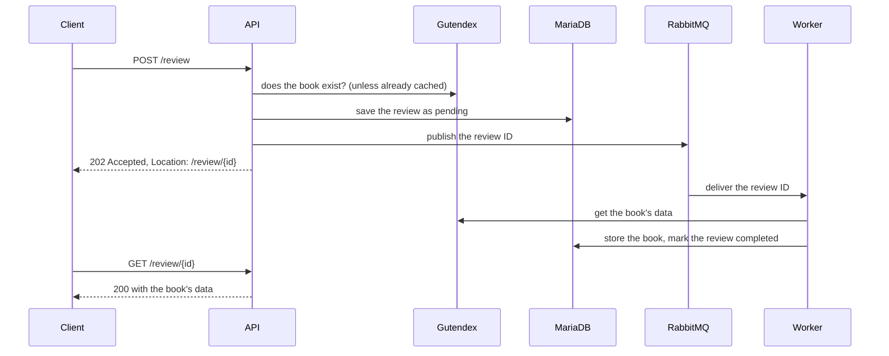

# Book reviews

A service to search the books of [Project Gutenberg](https://www.gutenberg.org), through the
[Gutendex](https://gutendex.com) API, and review them. A review is accepted right away; a worker
then adds the book's data (cover, authors, subjects, summary…) in the background.

Python 3.14, FastAPI, MariaDB, RabbitMQ. The original assignment is in [assignment.md](docs/assignment.md).

- [Start here](#start-here)
- [Quick start](#quick-start)
- [A tour of the API](#a-tour-of-the-api)
- [Endpoints](#endpoints)
- [Retries and concurrent edits](#retries-and-concurrent-edits)
- [Authentication](#authentication)
- [How it works](#how-it-works)
- [Observability](docs/operations.md#observability)
- [Deploying to Kubernetes](docs/operations.md#deploying-to-kubernetes)
- [Operations](docs/operations.md#operations)
- [Design notes](docs/architecture.md#design-notes)
- [Configuration](docs/configuration.md#configuration)
- [Development](#development)

## Start here

The [assignment](docs/assignment.md) asks for five endpoints, data enriched asynchronously through a
public API, an easy way to run the service, and tests. With Docker, checking it takes a few
minutes:

1. **Run it.** From this folder, `docker compose up --build --wait` starts everything, see
   [Quick start](#quick-start).
2. **Try it.** [A tour of the API](#a-tour-of-the-api) searches a book, reviews it, waits for the
   enrichment, then changes and deletes the review, with `curl`. Writes need the header
   `X-API-Key: local-dev-key`.
3. **Test it.** `make test-all` runs the unit and integration tests against MariaDB and RabbitMQ;
   `make e2e` checks a whole fresh stack from the outside.

| The assignment asks for | Where it is |
|---|---|
| `GET /book/search?q=` on a public API | Gutendex, through [gutendex.py](src/bookreviews/adapters/gutendex.py) and [books.py](src/bookreviews/api/books.py) |
| `POST /review`, checking the book on the API, the score and the text | [reviews.py](src/bookreviews/api/reviews.py): 422 naming the wrong field, otherwise 202 |
| a reference to follow the processing | the review's ID, in the `Location` header of the 202 |
| the enriched data saved asynchronously | RabbitMQ and the [worker](src/bookreviews/worker/runner.py), see [How it works](#how-it-works) |
| `GET /review/{id}`: 202 while processing, 200 with the enriched data | [reviews.py](src/bookreviews/api/reviews.py) |
| `PUT` and `DELETE /review/{id}` | [reviews.py](src/bookreviews/api/reviews.py) |
| tests, static analysis, coding standards | pytest, ruff, mypy in strict mode, pre-commit hooks, GitHub Actions |

**Beyond the assignment.** Each addition answers a question that a service in production faces:
- *Who may write?* API keys, and reviews that belong to the client that wrote them, see
  [Authentication](#authentication).
- *What if a client sends a request twice, or two clients edit at once?* Idempotency keys and
  entity tags, see [Retries and concurrent edits](#retries-and-concurrent-edits).
- *What if Gutendex is slow or down?* Timeouts, a cache, a circuit breaker, retries and a sweeper,
  see [Gutendex is slow](docs/architecture.md#gutendex-is-slow) and [Asynchronous enrichment](docs/architecture.md#asynchronous-enrichment).
- *How do we know it works?* Metrics, traces, alerts and a runbook, see
  [Observability](docs/operations.md#observability) and [Operations](docs/operations.md#operations).
- *How does it run for real?* Kubernetes manifests, verified on a local cluster, see
  [Deploying to Kubernetes](docs/operations.md#deploying-to-kubernetes).

The pull requests of the repository follow the same path, one step at a time, from the first
endpoint to operations.

## Quick start

You only need Docker with Compose. From this folder, `project-be-books`:

```bash
docker compose up --build --wait
```

This starts MariaDB, RabbitMQ, a one-shot job that applies the database migrations, the API and
the enrichment worker. Then:

- API: http://localhost:8080, with interactive documentation at http://localhost:8080/docs
- RabbitMQ management: http://localhost:15672 (`user` / `password`)

**Writing needs an API key.** `POST`, `PUT` and `DELETE` on `/review` need the header
`X-API-Key: local-dev-key` (the key of the `local-dev` client); without it the answer is
`401 Unauthorized`. Searching and reading need no key. See [Authentication](#authentication).

The ports are published on 127.0.0.1 only, so the development passwords stay on your machine.
`docker compose down` stops everything; add `-v` to delete the database volume too.

## A tour of the API

Find a book:

```bash
curl "localhost:8080/book/search?q=pride%20prejudice"
```

```json
{
  "count": 6,
  "page": 1,
  "next_page": null,
  "results": [
    {
      "id": 1342,
      "title": "Pride and Prejudice",
      "authors": ["Austen, Jane"],
      "languages": ["en"],
      "cover_url": "https://www.gutenberg.org/cache/epub/1342/pg1342.cover.medium.jpg",
      "download_count": 190246
    }
  ]
}
```

The first time, this can take up to a minute: Gutendex needs 15–60 s for a search its CDN hasn't
cached yet. After 60 s the API gives up with `504 Gateway Timeout`, but Gutendex finishes the work
and caches the result, so the same search a few minutes later answers at once. See
[Gutendex is slow](docs/architecture.md#gutendex-is-slow).

Review it, using the `id` of the book. Writing needs an API key; the answer is `202 Accepted` with
the address of the review:

```bash
curl -i -X POST localhost:8080/review \
  -H "X-API-Key: local-dev-key" \
  -H "Content-Type: application/json" \
  -d '{"id": 1342, "review": "A classic.", "score": 9}'
```

```http
HTTP/1.1 202 Accepted
location: /review/01a1023f-006d-716b-abee-f6d3e9210156
content-type: application/json

{"id": "01a1023f-006d-716b-abee-f6d3e9210156", "status": "pending", "book_id": 1342,
 "review": "A classic.", "score": 9, "created_at": "2026-10-03T14:50:45.712345Z",
 "updated_at": "2026-10-03T14:50:45.712345Z", "book": null}
```

Read it. While the worker has not processed it yet, the answer is `202` with `Retry-After`; then it
is `200` with the data of the book. That takes about a second when Gutendex has the book cached, up
to a minute when it doesn't:

```bash
curl -i localhost:8080/review/01a1023f-006d-716b-abee-f6d3e9210156
```

```json
{
  "id": "01a1023f-006d-716b-abee-f6d3e9210156",
  "status": "completed",
  "book_id": 1342,
  "review": "A classic.",
  "score": 9,
  "created_at": "2026-10-03T14:50:45.712345Z",
  "updated_at": "2026-10-03T14:50:45.712345Z",
  "book": {
    "id": 1342,
    "title": "Pride and Prejudice",
    "authors": [{"name": "Austen, Jane", "birth_year": 1775, "death_year": 1817}],
    "subjects": ["Courtship -- Fiction", "Domestic fiction", "England -- Fiction", "..."],
    "bookshelves": ["Best Books Ever Listings", "Harvard Classics", "..."],
    "languages": ["en"],
    "summaries": ["\"Pride and Prejudice\" by Jane Austen is a novel published in 1813. ..."],
    "cover_url": "https://www.gutenberg.org/cache/epub/1342/pg1342.cover.medium.jpg",
    "download_count": 190246
  }
}
```

The worker is often quicker than a second `curl`, so the `202` can go unseen. To watch it, stop
the worker, submit a review and read it, then start the worker and read it again:

```bash
docker compose stop worker
docker compose start worker
```

Change it, then delete it, with the key of the client that wrote it:

```bash
curl -X PUT localhost:8080/review/01a1023f-006d-716b-abee-f6d3e9210156 \
  -H "X-API-Key: local-dev-key" \
  -H "Content-Type: application/json" \
  -d '{"review": "Even better the second time.", "score": 10}'
curl -X DELETE localhost:8080/review/01a1023f-006d-716b-abee-f6d3e9210156 \
  -H "X-API-Key: local-dev-key"
```

## Endpoints

| Endpoint | Success | Errors |
|---|---|---|
| `GET /book/search?q={keywords}&page={n}` | 200 | 422 invalid parameters, 404 page past the end, 502/503/504 Gutendex |
| `POST /review` 🔑 | 202 and `Location` | 401, 413, 422 invalid body, unknown book or reused `Idempotency-Key`, 502/503/504 Gutendex, 503 database |
| `GET /review/{id}` | 202 while `pending`, 200 once `completed` or `failed`, 304 with `If-None-Match` | 404, 422 malformed ID, 503 database |
| `PUT /review/{id}` 🔑 | 200 | 401, 403, 404, 412, 413, 422, 503 database |
| `DELETE /review/{id}` 🔑 | 204 | 401, 403, 404, 412, 422 malformed ID, 503 database |
| `GET /healthz` | 200: the process is up | |
| `GET /readyz` | 200: the database is reachable | 503 |

🔑 needs an `X-API-Key` header, see [Authentication](#authentication). Reading and searching are
public.

A 503 carries `Retry-After`: the database is unreachable, or calls to Gutendex are suspended after
repeated failures or because too many are already in progress. A body larger than 64 KiB gets 413.

**Search.** `q` holds the words to look for in titles and author names (at most 200 characters);
results come 32 per page, the most downloaded first.

**Reviews.**
- `id`: the Gutenberg ID of the book, as a number or a numeric string. The book must exist in the catalog.
- `review`: 3 to 5000 characters once trimmed. Line breaks and tabs are fine; other control characters are rejected.
- `score`: an integer from 1 to 10.
- Unknown fields are rejected.

`PUT` takes `review` and `score` only, because the book of a review cannot change.
A review is `failed` when its book is no longer in the catalog by the time the worker processes it.

**Errors** are [RFC 9457](https://www.rfc-editor.org/rfc/rfc9457) problem documents,
`application/problem+json`:

```json
{
  "title": "Unprocessable Content",
  "status": 422,
  "detail": "the request is not valid",
  "instance": "/review",
  "request_id": "c54ea9493df2481cbbc9436be65f2157",
  "errors": [{"field": "body.score", "message": "Input should be less than or equal to 10"}]
}
```

The OpenAPI document is served at `/openapi.json` and kept in [docs/openapi.json](docs/openapi.json);
a test fails when the two differ.

## Retries and concurrent edits

**Retrying a POST.** A client that gets no answer (a timeout, a dropped connection) can't know
whether its review was saved. If it sends an `Idempotency-Key` header, it can safely send the
request again. The key is a value unique to that review, such as a UUID:

```bash
curl -i -X POST localhost:8080/review \
  -H "X-API-Key: local-dev-key" \
  -H "Idempotency-Key: 6f1c7e0e-3c2a-4d8e-9a43-5b1f0d2c7e91" \
  -H "Content-Type: application/json" \
  -d '{"id": 1342, "review": "A classic.", "score": 9}'
```

- **Same key, same body.** The answer is the review created the first time, with the same
  `Location`, instead of a duplicate.
- **Same key, different body.** The answer is 422.
- **Scope and lifetime.** Keys belong to the client, so two clients may pick the same value. They
  are remembered for 24 hours, and only while their review exists.

**Lost updates.** Every review response carries an `ETag`. Sent back in `If-Match` with `PUT` or
`DELETE`, it makes the change conditional: if the review has changed in the meantime, through
another edit or because the worker added the book, the answer is `412 Precondition Failed`, and the
client reads the review again before retrying. Without `If-Match` the change is unconditional.

```bash
curl -i -X PUT localhost:8080/review/01a1023f-006d-716b-abee-f6d3e9210156 \
  -H "X-API-Key: local-dev-key" \
  -H 'If-Match: "3f7a9c2e5b8d4f6a1c0e9b7d5a3f1e2c"' \
  -H "Content-Type: application/json" \
  -d '{"review": "Even better the second time.", "score": 10}'
```

**Polling.** A client waiting for the book data can send the `ETag` it has in `If-None-Match`. The
answer is `304 Not Modified`, without a body, until the review changes.

## Authentication

The service is meant to be called by other applications. Each one is a client with a name and an
API key, sent in the `X-API-Key` header to create, change or delete reviews.

- **Ownership.** A review belongs to the client that wrote it: another client gets 403 when it tries
  to change or delete it. Reviews written before API keys existed belong to `anonymous`, a client
  that exists only if someone configures it.
- **Keys at rest.** The service stores only the SHA-256 digest of each key, in `API_KEYS`, and
  compares digests in constant time. A key is a 256-bit random value, so a fast hash is enough.
- **New keys.** `bookreviews-api-key NAME` prints a new key for the client `NAME`, to hand over, and
  the entry to add to `API_KEYS`:

  ```bash
  docker compose run --rm --no-deps api bookreviews-api-key web-shop
  ```

  ```text
  API key for web-shop; hand it to the client, it is not stored anywhere:
    bkr_3V0zvq8G6cJ1pKf9wQ2xYbN7dLmA4sTeR5uHiOjKlZc
  Entry to add to API_KEYS:
    "web-shop": "1f0b4b5c8e3d2a7f9c6e5d4b3a2f1e0d9c8b7a6f5e4d3c2b1a0f9e8d7c6b5a4f"
  ```

  `API_KEYS` is a JSON object from client names to digests, for example
  `{"web-shop": "1f0b…", "mobile-app": "9a8b…"}`.
- **Rotation.** A client may have several keys, `{"web-shop": ["1f0b…", "77c2…"]}`. To rotate a
  key, add the new digest next to the old one, let the client switch, then remove the old digest.
  The client's name doesn't change, so it keeps its reviews.
- **Logs.** Every log line of an authenticated request carries the client's name.

## How it works



```text
src/bookreviews/
├── core/               book/review types, ports and application use cases
├── api/                endpoints, schemas, conditional requests and dependencies
├── adapters/
│   ├── gutendex.py     external catalog client
│   ├── catalog.py      cache, concurrency limit and circuit breaker
│   ├── queue.py        RabbitMQ topology and publishing
│   ├── database/       models, repository, connections and schema management
│   └── migrations/     versioned Alembic migrations
├── worker/
│   ├── runner.py       process lifecycle, connections and consumption
│   ├── messages.py     acknowledgements, retries and parking
│   └── sweeper.py      recover pending reviews and expire idempotency keys
├── observability/      logging, metrics, catalog measurements, traces and ops server
├── cli/                API, worker, migrations, admin, API keys and OpenAPI commands
├── config.py           validated environment settings
└── wiring.py           compose the database engine and catalog decorators
```

`core` defines the ports (`ReviewRepository`, `BookCatalog`, `ReviewQueue`,
`EnrichmentRepository`) that adapters implement and tests replace with fakes. HTTP, database
and RabbitMQ types stay outside it; the review service still records business metrics directly. The API
and the worker run from the same image; each command is a console script of the package.

The tests are grouped by responsibility: `tests/unit/` exercises isolated components, `tests/integration/`
runs against MariaDB and RabbitMQ, and `tests/e2e/` checks a whole stack or cluster from the outside.

## Development

You need [uv](https://docs.astral.sh/uv/), which also installs Python 3.14, and Docker for the
services and the integration tests. `make` lists the tasks; these are the commands behind them:

| Task | Command |
|---|---|
| Install the dependencies | `uv sync` |
| Start MariaDB and RabbitMQ | `docker compose up --detach --wait db rabbitmq` |
| Apply the migrations | `make migrate` (as the `migrator` account) |
| Run the API / the worker | `uv run bookreviews-api` / `uv run bookreviews-worker` |
| Unit tests | `uv run pytest --cov` |
| All the tests | `make test-all` |
| End-to-end checks on a fresh stack | `make e2e` (`uv run python -m tests.e2e.stack`) |
| Format, lint, types | `make fmt`, `make lint` (ruff, mypy) |
| Git hooks, and every hook on all the files | `make hooks`, `make check` |
| Export the OpenAPI document | `make openapi` |
| Stack with Prometheus, Grafana and Jaeger | `make observability` |
| Check the Prometheus configuration and test the alerts | `make alerts` |
| Validate the Kubernetes manifests | `make manifests` |
| Local Kubernetes cluster with kind | `make kind-up`, `make kind-verify`, `make kind-down` |

**Tests.**
- The unit tests need nothing else.
- The integration tests run against MariaDB and RabbitMQ when `TEST_DATABASE_URL` and
  `TEST_RABBITMQ_URL` are set, and are skipped otherwise. `make test-all` sets them for the
  Compose services.
- `GUTENDEX_LIVE_TEST=1` adds a contract test against the real Gutendex.
- `make e2e` builds the image and starts the whole stack, Prometheus, Grafana and Jaeger included,
  as a separate Compose project with its own volumes. It runs about 140 checks against it, then
  removes it (`--keep` leaves it running). The checks cover the API, what happens when each
  dependency fails, the operations commands, metrics and traces, and take about six minutes. The
  stack uses the same ports as `make up`, so stop that first. Gutendex is live: the few checks that
  depend on it are skipped when it times out.

**Migrations.** With the database running,
`uv run alembic revision --autogenerate --rev-id 0005 -m "what changes"` writes the next migration
from the models, numbered after the last one and formatted by ruff; review it before committing.

**Database accounts.** [deploy/mariadb/users.sql](deploy/mariadb/users.sql) creates them the first
time the volume is initialised. On a volume created before that script existed, apply it once:

```bash
docker compose exec -T db mariadb -uroot -prootpassword < deploy/mariadb/users.sql
```

**Git hooks.** [.pre-commit-config.yaml](.pre-commit-config.yaml) belongs to this project and checks
only its files. `make hooks` installs it (`uv run pre-commit install --config
.pre-commit-config.yaml` without `make`), and `make check` runs it on every file.
- **On every commit:** ruff (lint and format) and mypy; a check that `uv.lock` matches
  `pyproject.toml`; codespell on code and docs; shellcheck on the scripts; hadolint on the
  Dockerfile; and the usual hygiene checks (JSON, YAML and TOML syntax, merge conflicts, large
  files, private keys, trailing whitespace).
- **Before every push:** the tests, the integration ones included when `TEST_DATABASE_URL` and
  `TEST_RABBITMQ_URL` are set.
- **Not here:** the checks that need Docker, such as the alert rule tests, would fail whenever Docker
  is not running, so they stay in CI.

**CI.** GitHub Actions runs on every change to this folder:
- ruff, mypy and pip-audit;
- the other commit hooks, so they hold even for commits made without them;
- the Prometheus configuration and the alert rule tests, with `promtool`;
- the whole test suite against the MariaDB and RabbitMQ of [docker-compose.yaml](docker-compose.yaml),
  so updating their images there tests the new versions;
- a smoke test of the Docker image and a Trivy scan of it;
- the Kubernetes overlays, built with Kustomize and validated with kubeconform;
- on `main`, the publication of the image to GHCR.

Dependabot proposes the dependency updates, see [Security](docs/architecture.md#security).
